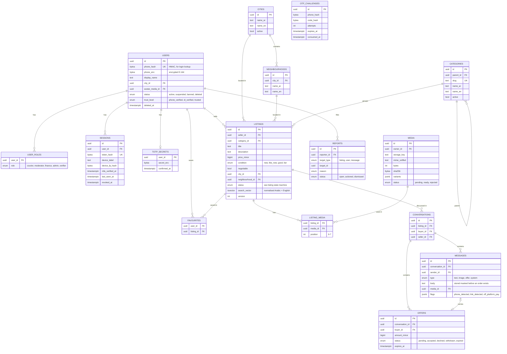
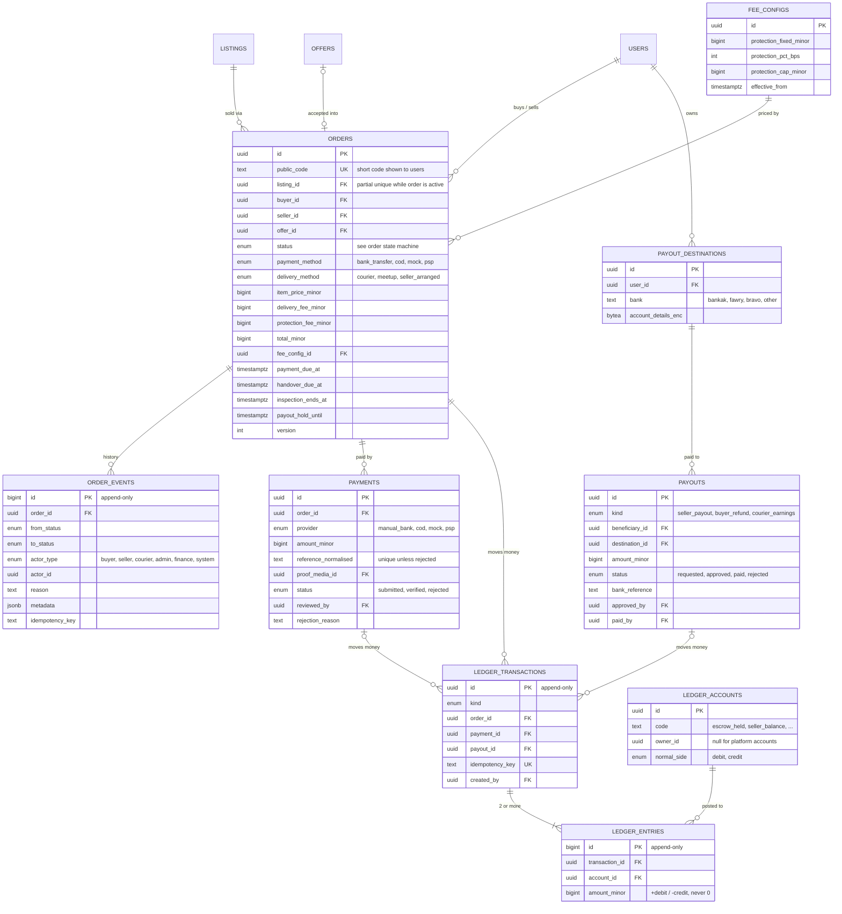
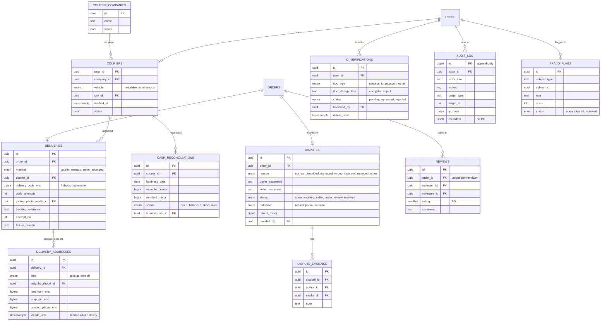
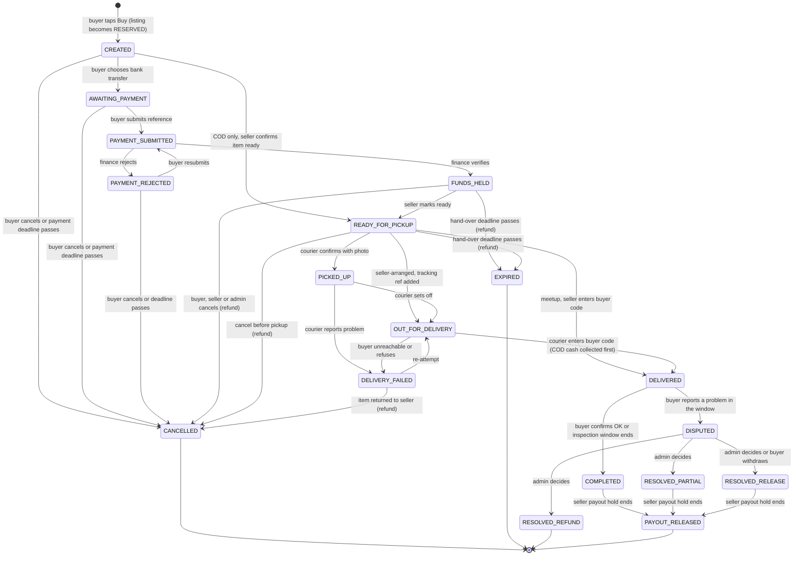
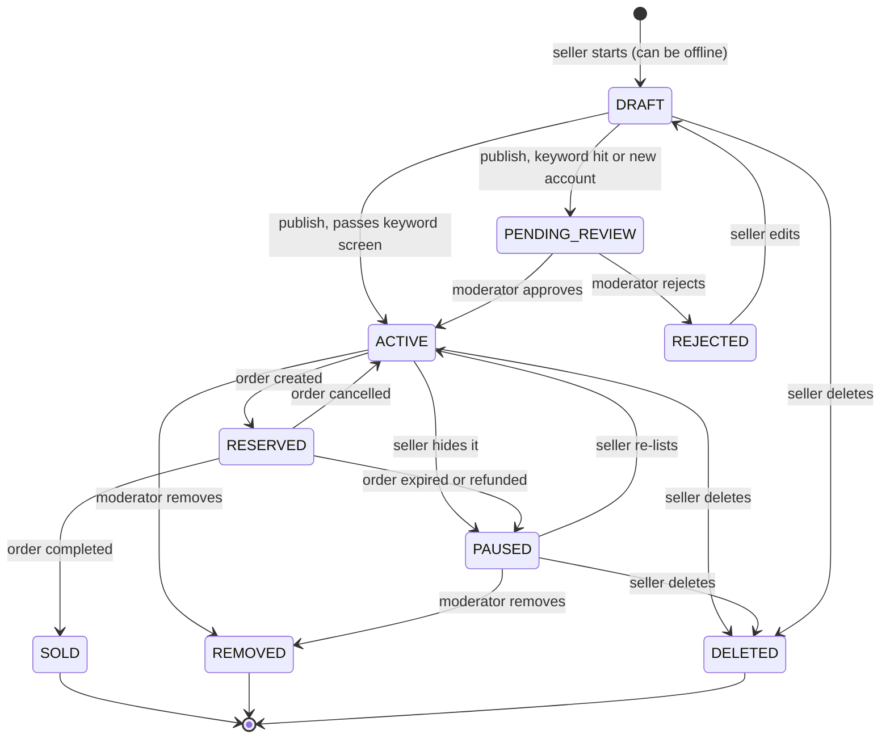
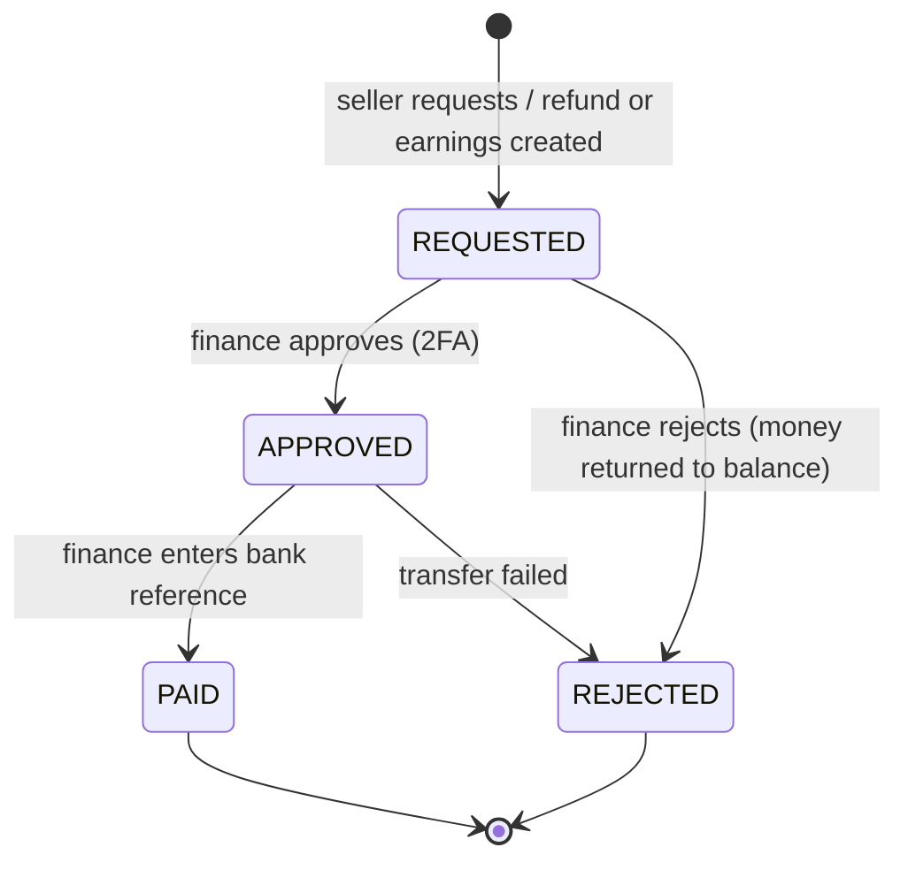

# Phase 0 — Plan

Status: **awaiting approval**. No application code has been written.

This document answers PROMPT.md §6 Phase 0:

1. [Tech stack and why](#1-tech-stack)
2. [Data model (ERD)](#2-data-model)
3. [State machines](#3-state-machines)
4. [Ledger design](#4-ledger)
5. [Folder structure](#5-folder-structure)
6. [How Codespaces will work](#6-codespaces)
7. [Open questions](#7-open-questions)

---

## 1. Tech stack

I kept most of the suggested stack. Where I chose between options, or changed something, the reason is given.

| Layer | Choice | Why |
|---|---|---|
| Language | **TypeScript** everywhere, Node.js 22 LTS | One language for the web app, API, workers, and shared domain code. |
| Monorepo | **pnpm workspaces** | The web app, API, and worker all share the state machine, ledger, and validation schemas. pnpm is fast and saves disk space in Codespaces. |
| Web app | **Next.js (App Router) + Tailwind CSS**, as a PWA | Server Components ship very little JS, which helps the under-200 KB target. Tailwind's logical properties (`ms-*`, `pe-*`, `start-*`) make RTL work without writing layouts twice. CI will fail the build if the first-load JS is over budget. |
| API | **Separate Fastify service** (not Next.js route handlers) | See below. |
| Validation | **Zod**, shared between web and API | One schema per endpoint, used for both request validation and TypeScript types. |
| Database | **PostgreSQL 16** | Transactions, row locks (`SELECT … FOR UPDATE`), check constraints, triggers, and full-text search, all in one place. |
| DB access | **Drizzle ORM** + hand-written SQL migrations | See below. |
| Cache/queues | **Redis** + **BullMQ** | Rate limits, OTP throttling, job queues, and the Socket.IO adapter. |
| Realtime | **Socket.IO** | It falls back to HTTP long-polling on its own when WebSockets are blocked. That covers the "polling fallback" requirement without extra work. |
| File storage | S3-compatible: **MinIO** in development, **Cloudflare R2** in production | R2 has no download (egress) fees and sits behind Cloudflare's CDN, which we need anyway. |
| Images | Browser-side compression before upload, then **sharp** on the server | The server always re-encodes to WebP/AVIF, which also removes EXIF/GPS data. It makes 3 sizes (320, 800, 1280 px). |
| i18n | **next-intl**, Arabic default, English second | Message files live in `packages/i18n`, so the API and workers (SMS text, notifications) use the same files. |
| Auth | **Own implementation**: phone + OTP, database sessions | See below. |
| Admin 2FA | TOTP (`otplib`) | Works with Google Authenticator and similar apps. |
| Tests | **Vitest** (unit/integration), **Playwright** (E2E + RTL screenshot check at 360 px) | Coverage gate: 100% on `packages/domain` (state machine, ledger, fees). |
| CI | GitHub Actions + CodeQL + Dependabot + secret scanning | As required in §7. |

### Why a separate Fastify API instead of Next.js route handlers

- **Realtime chat needs a long-running server.** Socket.IO does not fit well inside Next.js route handlers.
- **Background workers need the same code.** Timers (auto-complete, deadlines) run in a worker process. Keeping the business logic in shared packages, called by a plain Node API, means the API and worker run the exact same code.
- **One API for the future native app.** The Android app can call the same endpoints.
- **Clear security boundary.** All authorisation checks (the IDOR tests) live in one service.
- **Why Fastify and not NestJS:** Fastify is small, fast, and easy to read. NestJS adds a lot of structure (decorators, dependency injection) that a small team does not need yet.
- **Cost of this choice:** two deployable services instead of one. To avoid cookie and CORS problems, both will be served from **the same domain**: `/api/*` goes to Fastify and everything else to Next.js. Cookies stay first-party, and no CORS is needed.

### Why Drizzle and not Prisma

- The ledger and state machine depend on **database-level guarantees**: triggers that stop updates/deletes on append-only tables, a deferred trigger that checks each ledger transaction sums to zero, partial unique indexes that stop an item being sold twice, and `FOR UPDATE` locks. Drizzle stays close to SQL and handles all of this well. With Prisma, much of it has to be written as raw SQL outside the ORM.
- Drizzle is lighter at runtime and handles `bigint` money directly.

### Why our own auth and not a library/service

- Login is **phone + OTP through a pluggable SMS provider**, and most hosted auth services only support a few international SMS providers.
- We need specific rules: OTP hashed and single-use, 5-minute expiry, attempt limits, per-phone and per-IP rate limits, session rotation, a device list, and "log out other devices". This is about 300 lines of well-tested code.
- Sessions are **random tokens stored hashed in Postgres**, not JWTs, so that a session can be revoked immediately.

### Why not Supabase (for now)

Supabase would work as **managed Postgres + storage in production**, and we can still choose that later. I'm not using Supabase Auth, Realtime, or row-level security as the main design, for the reasons above (SMS provider, polling fallback, and keeping authorisation in one tested place). Everything stays plain Postgres, so we can move hosts without rewriting anything.

### Money

- Stored as `bigint` **minor units** (1 SDG = 100 piastres), in every table.
- In TypeScript, money is a `bigint` inside a small `Money` type. It is sent in JSON **as a string** so JavaScript never turns it into a float.
- Fee maths uses whole numbers only (percentages as basis points, e.g. 5% = 500 bps), with one documented rounding rule.

### Security building blocks (details in each phase)

- Field-level encryption (AES-256-GCM, key version stored with the data) for: phone numbers, exact addresses/map pins, payout bank details, ID documents, delivery codes.
- Phone lookup at login uses an **HMAC hash** of the number, so the plain number never needs to be searched.
- CSRF: `SameSite=Lax` cookies plus an origin check and a CSRF header on every write.
- Idempotency: every payment/order write requires an `Idempotency-Key` header. The first response is stored and replayed for repeats.
- Every admin/finance action is written to an append-only `audit_log`.

---

## 2. Data model

Split into three diagrams so each one is readable. Key columns only; all tables also have `created_at`, and IDs are UUIDs unless stated.

### 2a. People, places, listings, chat



### 2b. Orders, payments, ledger, payouts



### 2c. Delivery, trust, disputes, admin



Supporting tables not drawn: `idempotency_keys`, `notifications`, `settings` (inspection window, deadlines, feature flags such as "approx. USD"), `prohibited_terms`, `delivery_fee_rules` (per city/zone), `recovery_codes`.

**Guarantees enforced by the database itself** (not only by code):

- `order_events`, `ledger_transactions`, `ledger_entries`, `audit_log`: a trigger rejects `UPDATE` and `DELETE`. Mistakes are fixed with a new reversing entry.
- `ledger_entries`: a deferred trigger checks that every transaction's entries **sum to zero** when the DB transaction commits.
- `orders`: a partial unique index on `listing_id` for active statuses. Even if two buyers tap **Buy** at the same instant, only one order can exist.
- `payments.reference_normalised`: a partial unique index across non-rejected payments stops the same bank reference being used twice.
- No table has a balance column.

---

## 3. State machines

All transitions are defined in **one file** (`packages/domain/src/order/transitions.ts`) as data: from, to, who may do it, the guard, and the side effects. One function, `transition(orderId, event, actor, idempotencyKey)`, runs every change inside a single DB transaction:

1. `SELECT … FROM orders WHERE id = $1 FOR UPDATE`
2. Check the current status and the actor's permission. Run the guard.
3. Update `orders.status` and `version`.
4. Insert an `order_events` row (who, when, why).
5. Post any ledger transaction and lock/unlock the listing.
6. Commit. Notifications and timers are queued only **after** commit.

Nothing else in the codebase is allowed to write `orders.status`. A lint rule plus a test enforce this.

### 3a. Order state machine



**Transition table** (this becomes the test matrix: every row is tested, and every pair not in the table is tested as rejected):

| # | From | To | Who | Guard | Side effects |
|---|---|---|---|---|---|
| 1 | — | CREATED | buyer | listing ACTIVE; buyer ≠ seller; new-account limits; price from listing or accepted offer | listing → RESERVED; fee snapshot; `payment_due_at` set |
| 2 | CREATED | AWAITING_PAYMENT | buyer | method = bank transfer | show platform account + order reference |
| 3 | CREATED | READY_FOR_PICKUP | seller | method = COD; delivery = courier; buyer eligible for COD | `handover_due_at` set; queue for courier assignment |
| 4 | CREATED, AWAITING_PAYMENT, PAYMENT_REJECTED | CANCELLED | buyer / system | no money received | listing → ACTIVE |
| 5 | AWAITING_PAYMENT, PAYMENT_REJECTED | PAYMENT_SUBMITTED | buyer | reference not already used; attempt limit | payment row `submitted` |
| 6 | PAYMENT_SUBMITTED | FUNDS_HELD | finance/admin (2FA) or PSP webhook | amount = order total | ledger **L1**; `handover_due_at` set |
| 7 | PAYMENT_SUBMITTED | PAYMENT_REJECTED | finance/admin (2FA) | reason required | notify buyer |
| 8 | FUNDS_HELD | READY_FOR_PICKUP | seller | — | queue for courier assignment (if courier) |
| 9 | FUNDS_HELD, READY_FOR_PICKUP | CANCELLED | buyer / seller / admin | not yet picked up | ledger **L7** if money held; listing → ACTIVE; seller-cancel counts against seller |
| 10 | FUNDS_HELD, READY_FOR_PICKUP | EXPIRED | system | `handover_due_at` passed | ledger **L7** if money held; listing → PAUSED |
| 11 | READY_FOR_PICKUP | PICKED_UP | assigned courier | pickup photo uploaded | pickup address hidden from courier |
| 12 | READY_FOR_PICKUP | OUT_FOR_DELIVERY | seller | delivery = seller-arranged; tracking ref | — |
| 13 | READY_FOR_PICKUP | DELIVERED | seller | delivery = meetup; correct buyer code | `inspection_ends_at` set |
| 14 | PICKED_UP | OUT_FOR_DELIVERY | assigned courier | — | — |
| 15 | OUT_FOR_DELIVERY | DELIVERED | assigned courier, or buyer for seller-arranged | correct code (max 5 tries, then locked + admin alert); COD: cash collected | COD: ledger **L2**; ledger **L4**; drop-off address hidden; `inspection_ends_at` set |
| 16 | PICKED_UP, OUT_FOR_DELIVERY | DELIVERY_FAILED | assigned courier | reason required | notify buyer + seller |
| 17 | DELIVERY_FAILED | OUT_FOR_DELIVERY | courier / admin | attempts < limit | — |
| 18 | DELIVERY_FAILED | CANCELLED | admin | seller confirms item returned | ledger **L7** (minus delivery fee, see open questions); listing → ACTIVE |
| 19 | DELIVERED | COMPLETED | buyer / system | no dispute; window open (buyer) or ended (system) | ledger **L5**; listing → SOLD; ratings unlocked |
| 20 | DELIVERED | DISPUTED | buyer | inside inspection window; reason + photos | timers paused |
| 21 | DISPUTED | RESOLVED_REFUND | admin (2FA) | decision note | ledger **L7** (+ return arrangement); listing → PAUSED |
| 22 | DISPUTED | RESOLVED_PARTIAL | admin (2FA) | 0 < refund < item price | ledger **L8** |
| 23 | DISPUTED | RESOLVED_RELEASE | admin (2FA) / buyer withdraws | — | ledger **L5**; listing → SOLD |
| 24 | COMPLETED, RESOLVED_PARTIAL, RESOLVED_RELEASE | PAYOUT_RELEASED | system | `payout_hold_until` passed; no open fraud flag | ledger **L6** |

Notes:

- **COD path:** the seller prepares the item before any money exists, so COD is limited to buyers with a good history and below a value cap (anti-fraud). The courier must record "cash collected" before entering the code, and both happen in one transition.
- **Meetup** requires prepayment by bank transfer (cash at a meetup would bypass escrow).
- A payment under review (`PAYMENT_SUBMITTED`) cannot be cancelled by the buyer, because the money may already be in our account. Finance must verify or reject it first.
- **`PAYOUT_RELEASED`** means the money moved from the seller's *pending* balance to their *withdrawable* balance. For established sellers the hold is 0, so it happens straight after completion. For new sellers it waits N days. The actual bank transfer is a separate **payout** (3c).

### Timers

Deadlines are stored on the order (`payment_due_at`, `handover_due_at`, `inspection_ends_at`, `payout_hold_until`). A worker runs every minute. It selects overdue orders with `FOR UPDATE SKIP LOCKED` and calls the same `transition()` function as everything else. If it runs twice, or two workers run at once, the second attempt sees the status has already changed and does nothing. That makes timers safe to run twice without any extra bookkeeping.

### 3b. Listing state machine



A `RESERVED` listing cannot be edited or deleted. Editing an `ACTIVE` listing runs the keyword screen again.

### 3c. Payout state machine (seller payouts, buyer refunds, courier earnings)



---

## 4. Ledger

Standard double-entry bookkeeping. Every movement of money is one **ledger transaction** with two or more **entries**. Each entry is a signed `bigint` (**+ debit / − credit**), and each transaction sums to zero. Balances are always calculated as `SUM(amount_minor)` for an account. They are never stored.

### Accounts

From PROMPT.md, plus four I added (marked ✚) because the flow needs them:

| Account | Meaning |
|---|---|
| `platform_bank` ✚ | Mirrors the real Bankak/bank account(s), ideally held by a licensed partner. Reconciled against bank statements. |
| `buyer_payments_clearing` | Money received that is not yet matched to an order (wrong amount, overpayment). Usually zero. |
| `escrow_held` | Buyer money held for active orders. |
| `platform_fees` | Our revenue (buyer-protection fees). |
| `seller_pending:{id}` ✚ | Seller's earnings from completed orders that are still in the new-seller hold. |
| `seller_balance:{id}` | Seller's withdrawable balance. |
| `payouts_in_flight` ✚ | Approved payouts not yet transferred. |
| `courier_cash:{id}` | COD cash a courier has collected and not yet handed in. |
| `courier_earnings:{id}` ✚ | Delivery fees we owe a courier. |
| `refunds` | Refunds we owe buyers, not yet transferred. |

### Postings

T = order total, P = item price, D = delivery fee, F = buyer-protection fee, r = partial refund.

| Code | Event | Debit | Credit |
|---|---|---|---|
| L1 | Bank transfer verified | `platform_bank` T | `escrow_held` T |
| L2 | COD cash collected at the door | `courier_cash:{c}` T | `escrow_held` T |
| L3 | Courier hands in COD cash | `platform_bank` x | `courier_cash:{c}` x |
| L4 | Item delivered by platform courier | `escrow_held` D | `courier_earnings:{c}` D |
| L5 | Order completed / released | `escrow_held` P+F | `seller_pending:{s}` P, `platform_fees` F |
| L6 | Seller hold ends | `seller_pending:{s}` P | `seller_balance:{s}` P |
| L7 | Refund (cancel, expiry, dispute) | `escrow_held` (what's held) | `refunds` (same) |
| L8 | Partial refund decision | `escrow_held` P+F | `refunds` r, `seller_pending:{s}` P−r, `platform_fees` F |
| L9 | Payout approved | `seller_balance:{s}` / `refunds` / `courier_earnings:{c}` | `payouts_in_flight` |
| L10 | Payout paid (bank ref entered) | `payouts_in_flight` | `platform_bank` |
| L11 | Payout rejected | `payouts_in_flight` | back to the source account |

Before L9 the service locks the seller's account row and checks that the balance covers the amount, so a seller can't withdraw the same money twice.

For **meetup** D = 0. For **seller-arranged** delivery, D goes to `seller_pending` with the item price.

These postings will be finalised and tested (100% branch coverage) in Phase 4.

---

## 5. Folder structure

```
souqna/
├── .devcontainer/
│   ├── devcontainer.json          # Codespaces setup
│   └── docker-compose.yml         # app + postgres + redis + minio
├── .github/
│   ├── workflows/ci.yml           # lint, typecheck, test, build, bundle-size budget
│   ├── workflows/codeql.yml       # SAST
│   └── dependabot.yml
├── apps/
│   ├── web/                       # Next.js PWA (UI only, calls the API)
│   │   ├── src/app/[locale]/
│   │   │   ├── (public)/          # home feed, search, listing page
│   │   │   ├── (account)/         # sell, my listings, chats, orders, payouts, profile
│   │   │   ├── courier/           # courier mobile view
│   │   │   └── admin/             # moderation, payments, disputes, payouts, audit
│   │   ├── src/components/
│   │   ├── src/lib/               # API client, formatting (money, dates)
│   │   ├── src/offline/           # IndexedDB drafts + retry queue
│   │   ├── public/                # manifest, icons
│   │   └── e2e/                   # Playwright tests (incl. RTL 360px screenshots)
│   ├── api/                       # Fastify + Socket.IO
│   │   └── src/
│   │       ├── plugins/           # session, csrf, rate-limit, idempotency, audit, headers, errors
│   │       └── modules/           # one folder per area, each with routes / service / policy / tests
│   │           ├── auth/  users/  listings/  search/  media/
│   │           ├── chat/  offers/  orders/  payments/  delivery/
│   │           └── disputes/  reviews/  payouts/  admin/  fraud/
│   └── worker/                    # BullMQ: timers, image processing, notifications, reports
├── packages/
│   ├── domain/                    # pure logic, no I/O, 100% coverage:
│   │                              #   order state machine, ledger postings, fees, Money,
│   │                              #   Arabic normalisation, phone/link masking
│   ├── db/                        # Drizzle schema, SQL migrations (triggers, constraints), seed data
│   ├── contracts/                 # Zod request/response schemas shared by web + api
│   ├── providers/                 # PaymentProvider (manual, cod, mock, psp stub),
│   │                              #   SmsProvider (mock, gateway, whatsapp stub), Storage (S3)
│   ├── i18n/                      # ar.json, en.json
│   └── config/                    # shared tsconfig, eslint, tailwind preset + design tokens
├── docs/
│   ├── plan/                      # this file
│   └── decisions/                 # 001-*.md, 002-*.md …
├── .env.example                   # placeholders only
├── package.json
├── pnpm-workspace.yaml
├── PROMPT.md
├── CLAUDE.md
└── README.md
```

Each API module has a `policy.ts` holding its object-level authorisation rules (e.g. "only the buyer, seller, assigned courier, or an admin can read this order"). Every route calls it, and the IDOR tests target these policies.

---

## 6. Codespaces

- The devcontainer starts **Postgres, Redis, and MinIO** next to the app container, so nothing is installed on your laptop. You only need a browser.
- One command starts everything: `pnpm dev` (web + API + worker together). Codespaces will show a pop-up to open the forwarded port in your browser.
- SMS in development uses a mock provider: OTP codes appear in the terminal and on a dev-only page, so no real SMS is sent.
- **Machine size:** I recommend the **4-core** machine. Next.js + Postgres + Redis + MinIO is slow on 2 cores. On a free personal GitHub account, the monthly Codespaces allowance is measured in core-hours, so a 4-core machine uses it twice as fast as a 2-core one. Remember to stop the codespace when you're done (GitHub also stops it automatically after 30 minutes idle by default).

Exact click-by-click steps ("Code" button → "Codespaces" tab → …) will be in the README in Phase 1, once there is something to run.

---

## 7. Open questions

I've suggested a default for each so you can reply "defaults OK" to any you don't want to decide now. Everything marked *(config)* is an admin setting and can change later without code.

### Legal and money

1. **Central Bank of Sudan licence.** I've assumed a licensed bank or PSP must hold the escrow money, and the design allows the "platform bank account" to be the partner's account. Do you already have a partner bank in mind (e.g. Bank of Khartoum for Bankak)? *This is the biggest launch risk and needs a Sudanese lawyer's opinion.*
2. **Buyer-protection fee** *(config)*: I propose fixed + % with a cap, and **no seller fee** (like Vinted). What numbers? Because of inflation I'd rather you set them than I guess.
3. **Refund of fees on cancellation:** default is a full refund (including the protection fee) whenever the buyer isn't at fault. If the buyer cancels after paying, should we keep the protection fee?
4. **Failed delivery:** if the buyer can't be reached or refuses the item, does the buyer lose the delivery fee? Default: yes, after 2 attempts.
5. **New-seller payout hold** *(config)*: default 7 days for a seller's first 3 completed orders, then 0.
6. **Minimum payout amount** and how often sellers can request a payout? Default: no minimum, one open request at a time.

### Operations

7. **Launch city.** One city to start. Which one (e.g. Port Sudan)?
8. **Timers** *(config)*: payment deadline 24 h (bank apps go down), seller hand-over 3 days, inspection window 48 h. OK?
9. **Who verifies manual payments, and when?** If it's only you, buyers may wait hours. Should the app show "verified within X hours, 9am–9pm"?
10. **Courier partners at launch.** Any company or riders already lined up? Is courier assignment by an admin (manual) fine for the MVP?
11. **Can couriers see the buyer's phone number** during an active delivery? Riders usually need to call. Default: yes, only while the delivery is active, hidden afterwards (same rule as the address).
12. **COD limits** *(config)*: default COD only for buyers with ≥ 1 completed order and orders below a value cap. OK?
13. **Returns in disputes:** for a full refund, must the item go back to the seller first, and who pays the return delivery? Default: yes it goes back; the seller pays if the item was not as described.
14. **Seller-arranged delivery:** default is that the buyer taps "I received it", and if they don't, admin follows up (no automatic completion). OK?

### Identity and trust

15. **SMS provider.** Which Sudanese SMS gateway reaches Zain, MTN, and Sudani reliably? Do you have a WhatsApp Business account for the OTP fallback?
16. **ID verification:** what sales total triggers required ID verification? Which documents do we accept, given many displaced people have lost papers?
17. **Minimum age** for sellers/buyers (e.g. 18)?

### Product and brand

18. **Brand name and domain.** Keep "Souqna / سوقنا"?
19. **Arabic copy review.** Is there someone who can check the Sudanese-dialect wording before launch?
20. **Hosting budget.** Rough monthly budget for servers, database, and storage? It decides between a simple VPS and managed services. (Choosing the host is a Phase 7 decision, but the budget helps now.)

---

## What happens after approval

Phase 1 (Foundation): monorepo + devcontainer + Docker Compose, lint/format/typecheck, CI, i18n with Arabic RTL default, design tokens, PWA shell, and phone-OTP login with sessions and a basic profile. Then I stop again for your review.
